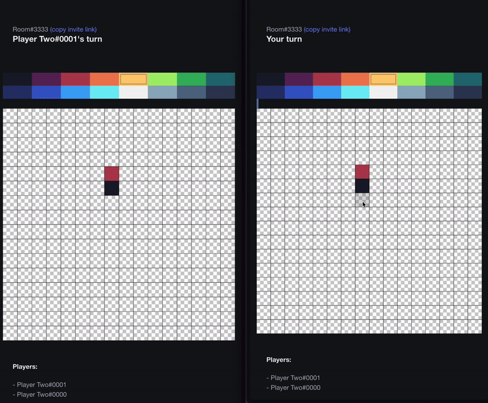

# Pixel Collab

"Party style" game where users take turns to draw a pixel art image. Only empty pixels can be filled, no overriding of others' art vision.

Project was created for exploring web dev with Golang.

## Tech: 
- [Echo](https://github.com/labstack/echo) framework on the backend
- No frontend frameworks/dependencies
- Live reloading with [Air](https://github.com/air-verse/air)
- SSE used for realtime updates

## Demo:
